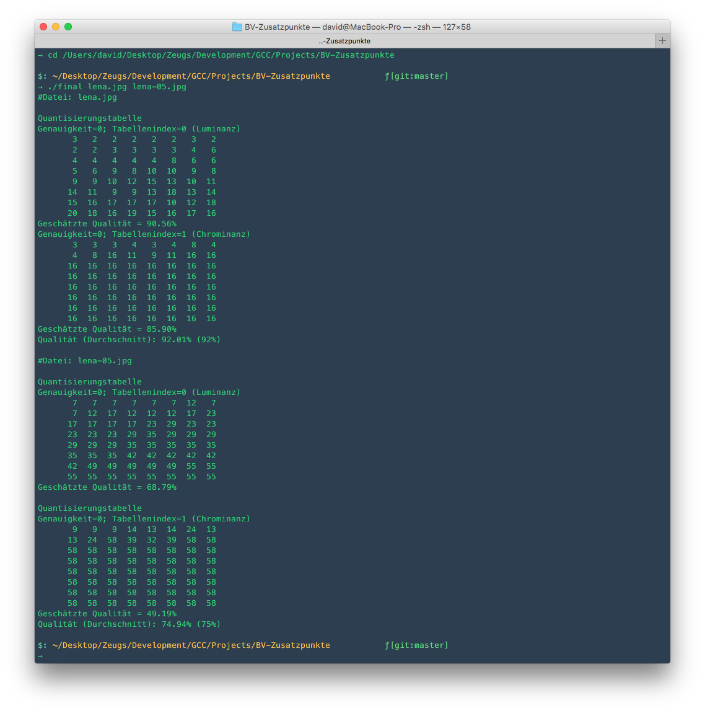

##Instructions
###Mac OS X
####1. Compile
	gcc final.c -o final
####2. Run
	./final lena.jpg lena-05.jpg
	
If it says something like 'Could not find stdlib.h' make sure you have the Xcode Command Line Tools installed.
To do this run 
```
xcode-select --install
```
##Example Screenshot
This is the current output of the application when runnign with the two sample picture in this repository (lena.jpg, lena-05.jpg)
[](sample-output.png)

